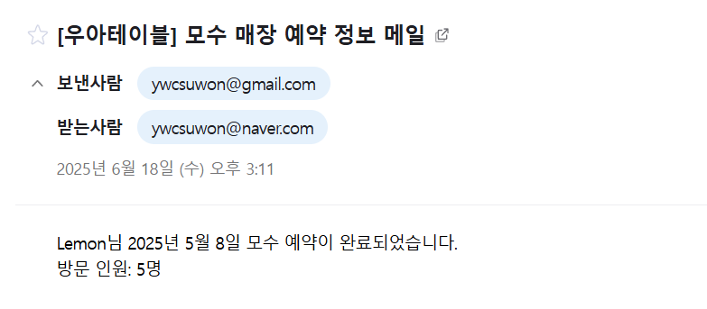

# 인프라 


## 구성 요소
### EC2 
- 개발 서버 EC2(public)
- 운영 서버 EC2(private)
- Nginx EC2

### RDS
- Mysql

### 웹 서버(리버스 프록시 서버)
리버스 프록시 서버 및 운영 서버와의 연결을 위해 nginx 웹 서버를 도입했습니다. SSL 인증서를 통해 HTTPS로 연결하였고, 가비아에서 해당 ip를 연결해놨습니다.
웹 서버는 외부와의 통신을 위해 public subnet에 위치시켰습니다.

### 개발 서버
개발 서버는 인프라테스트를 하다보니 시간상 public subnet에 위치시켰습니다. 시간이 더있었다면 private subnet에 위치시키고, SSM 연결을 통해 개발 EC2에 접근할 것 같습니다.

### 운영 서버
Nginx - 운영 서버를 연결시켜 동일 VPC에 존재하는 웹 서버를 통해서만 접근할 수 있도록 설정했습니다. 외부에서의 접근을 제한하기 위해 private 서브넷으로 두었습니다.

### RDS
사용자 정보, 예약 정보등의 민감 데이터에 대한 보안을 위해 private subnet에 위치시켰습니다. 제 서비스는 예약이 주된 비즈니스 로직이라 잦은 DB 접근이 예상됩니다. 매일 자동으로 백업되고, 실수로 데이터를 삭제해도 복구할 수 있습니고, 추후 사용자가 많아졌을때 간편한 확장을 할 수 있다고 생각했고, 짧은 시간동안 데이터베이스를 효율적으로 사용해보기 위해 RDS를 도입해보았습니다. 

### 네트워크 구성

```
Internet Gateway
    ↓
Public Subnet (Web Tier)
    ↓ (내부 통신만)
Private Subnet (App Tier)
    ↓ (내부 통신만)
Private Subnet (Data Tier)
```
제가 각 계층을 나눈이유는 계층별 독립성으로 부분 장애 시에도 다른 기능은 정상 동작하기 위해서입니다. 
또한 이 구성을 통해 애플리케이션 서버의 실제 IP와 포트를 외부에 노출하지 않으면서도, 모든 HTTP 트래픽을 암호화하여 중간자 공격을 방지할 수 있습니다.

# 맛집 예약 서비스

## 필수 기능 요구 사항
- 사용자는 특정 대상(회의실, 맛집, 클래스 등)을 예약할 수 있습니다.
- 모든 사용자는 예약 현황을 확인할 수 있습니다.
- 사용자 본인은 자신이 한 예약의 상세 정보까지 확인할 수 있습니다.
- 사용자는 본인의 예약만 수정하고 삭제할 수 있습니다.


## 📌 프로그래밍 요구사항
- 데이터베이스: H2 또는 MySQL을 활용하여 데이터를 관리합니다.
- 테스트: 애플리케이션이 의도한 대로 잘 동작하는지 테스트 코드를 통해 검증해야 합니다.
- 테스트의 범위와 방법(단위 테스트, 통합 테스트 등)은 스스로 결정합니다.
- 외부 API 연동 (필수): 외부 API를 최소 1개 이상 연동하여 서비스에 활용해야 합니다. (예: 날씨 API, 지도 API, 결제 API 등 자유롭게 선택)

---

## Member
- 멤버 생성

## Restaurant
- 식당 생성

## ReservationTime
- 예약 시간 생성

## Reservation
- 예약 생성
  - 예약 날짜가 공휴일 일때 예외 발생
- 전체 예약 목록 조회
- 로그인한 사용자 예약 목록 조회
- 예약 성공시 메일 전송
  
- 예약 수정
- 예약 삭제

## Auth
- 로그인
- 로그인 유지

### 개발 순서도
1. H2 DB 연결
2. Spring Data JPA 추가
3. 멤버 도메인 및 기능 구현
   - 멤버 도메인 구현
   - 회원가입 구현
4. 식당 도메인 및 기능 구현
   - 식당 도메인 구현
   - 식당 생성 구현
5. 예약 도메인 및 기능 구현
   - 예약 도메인 구현
   - 예약 생성 구현
   - 예약 전체 조회 구현
6. 로그인 구현
   - jwt 토큰 구현 
   - 로그인 유지 구현
7. 메일 기능 구현
   - 예약 성공시 사용자에게 예약 정보 메일 발송 구현
8. 로그인한 사용자 예약 기능 추가
- 예약 목록 조회 구현
- 예약 수정 구현
- 예약 삭제 구현 
9. 공휴일 API 연동
- 예약 날짜가 공휴일 일시 예외 발생
10. 테스트 추가
- 컨트롤러 테스트 추가
